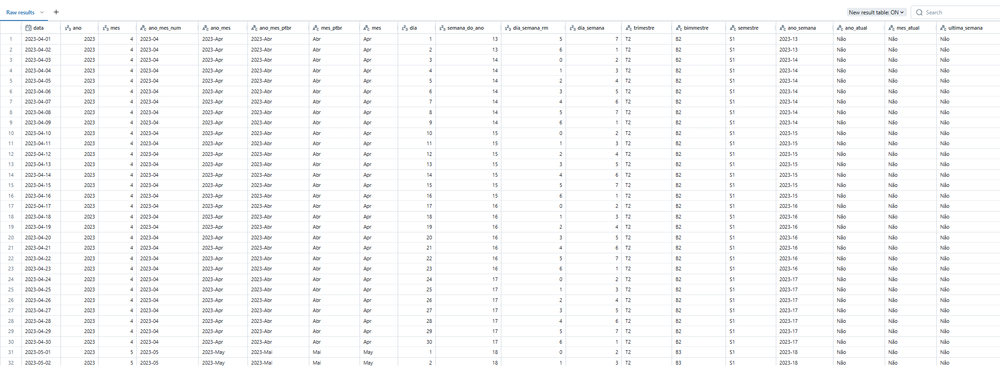

### 📆 <a href='https://github.com/ramoncampos/dCalendario-sql-databricks/blob/main/Tabela-calendario-em-SQL'>Tabela calendário</a>
Meu objetivo aqui foi utilizar as funções SQL do Databricks para criar uma tabela dimensão de calendário.

A lógica por trás dessa criação envolve definir a data mínima e máxima a partir de uma tabela de referência e, com isso, gerar uma sequência diária dentro desse intervalo. Em seguida, essa sequência é complementada com diversas colunas categóricas e numéricas que auxiliam na análise, como ano, mês, nome do dia da semana, semestre, bimestre, trimestre e outras informações relevantes.

Além das funções de inteligência de tempo, complementei a query com dados categóricos como `Último ano`, `Último mês` e `Última semana` utilizando a condicional ***CASE WHEN*** em conjunto com um ***Window Function***.

